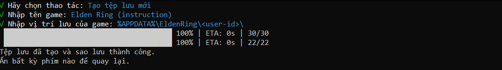

# Cloud Save Manager

Cloud Save Manager là một công cụ để quản lý các tệp lưu game sử dụng Google Drive. Nó cho phép bạn tải lên, tải xuống và quản lý các tệp lưu game trên đám mây.

## Tính năng

- Tải lên tệp lưu game lên Google Drive
- Tải xuống tệp lưu game từ Google Drive
- Liệt kê tất cả các tệp lưu game
- Tự động lưu tiến trình game theo khoảng thời gian định kỳ
- Nén và giải nén các tệp lưu game

## Prerequisites

Trước khi chạy chương trình, bạn cần cài đặt các công cụ và thư viện sau:

1. **Deno**:
    - Truy cập [Deno Land](https://deno.land/) và làm theo hướng dẫn để cài đặt Deno.

2. **Tài khoản Google Cloud**:
    - Bạn cần có một tài khoản Google Cloud để tạo service account và bật Google Drive API.

## Cài đặt

0. **Tải về bản biên dịch sẵn**:
    - Nếu bạn không muốn tự biên dịch, bạn có thể tải về bản biên dịch sẵn. Lưu ý rằng các bước 3, 4, 5, và 6 vẫn cần được thực hiện.

1. Clone repository:
    ```sh
    git clone <repository-url>
    cd <repository-directory>
    ```

2. Cài đặt các phụ thuộc:
    ```sh
    deno cache main.ts
    ```

3. Tạo service account:
    - Truy cập [Google Cloud Console](https://console.cloud.google.com/).
    - Tạo một dự án mới hoặc chọn một dự án hiện có.
    - Truy cập phần "IAM & Admin" > "Service Accounts".
    - Nhấp vào "Create Service Account".
    - Điền tên và mô tả cho service account, sau đó nhấp "Create".
    - Trong phần "Grant this service account access to project", chọn vai trò "Editor" hoặc "Owner", sau đó nhấp "Continue".
    - Trong phần "Grant users access to this service account", nhấp "Done".
    - Nhấp vào service account vừa tạo, sau đó nhấp vào tab "Keys".
    - Nhấp vào "Add Key" > "Create New Key".
    - Chọn định dạng JSON và nhấp "Create". File JSON sẽ được tải về máy tính của bạn.
    - Đổi tên file JSON thành `authentication.json` và đặt nó vào thư mục gốc của dự án.

4. Bật Google Drive API:
    - Truy cập [Google Cloud Console](https://console.cloud.google.com/).
    - Chọn dự án của bạn.
    - Truy cập phần "APIs & Services" > "Library".
    - Tìm kiếm "Google Drive API".
    - Nhấp vào "Google Drive API" và sau đó nhấp vào "Enable".

5. Tạo thư mục trên Google Drive và chia sẻ cho service account:
    - Truy cập [Google Drive](https://drive.google.com/).
    - Tạo một thư mục mới.
    - Nhấp chuột phải vào thư mục vừa tạo và chọn "Share".
    - Nhập email của service account và nhấp "Send".
    - Nhấp chuột phải vào thư mục và chọn "Get link".
    - Sao chép ID thư mục từ URL. Ví dụ: nếu URL là `https://drive.google.com/drive/folders/1a2b3c4d5e6f7g8h9i0j`, thì ID thư mục là `1a2b3c4d5e6f7g8h9i0j`.

6. Tạo file `cloudsave.init` và nhập vào ID thư mục gốc của bạn:
    ```
    your-root-folder-id
    ```

7. Compile file để tạo `cloudsave.exe`:
    ```sh
    deno compile --allow-all main.ts
    ```

8. Cất file `cloudsave.exe`, `authentication.json`, `cloudsave.init` vào một thư mục và nén nó lại:
    ```sh
    mkdir cloudsave_package
    mv cloudsave.exe authentication.json cloudsave.init cloudsave_package/
    zip -r cloudsave_package.zip cloudsave_package/
    ```

9. Tải file nén lên Google Drive và chia sẻ công khai:
    - Truy cập [Google Drive](https://drive.google.com/).
    - Tải lên file `cloudsave_package.zip`.
    - Nhấp chuột phải vào file vừa tải lên và chọn "Share".
    - Nhấp vào "Get link" và chọn "Anyone with the link".
    - Sao chép đường dẫn để tải file nén.

10. Sau này cần dùng thì tải file, giải nén nó để dùng.

## Sử dụng

Khi vừa bật ứng dụng lên, bạn sẽ thấy menu chính với các tùy chọn sau:


### Chọn game đã lưu

1. Chọn "Tìm game đã lưu" từ menu chính.
2. Một danh sách các game đã lưu sẽ hiển thị. Chọn game bạn muốn thao tác.

3. Sau khi chọn game, bạn sẽ thấy các tùy chọn sau:
    - **Sao lưu**: Lưu lại tiến trình game hiện tại.
    - **Khôi phục**: Khôi phục tiến trình game từ bản lưu trên đám mây.
    - **Tự động lưu**: Thiết lập tự động lưu tiến trình game theo khoảng thời gian định kỳ.
    - **Quay lại**: Quay lại menu chính.

### Tạo tệp lưu mới

1. Chọn "Tạo tệp lưu mới" từ menu chính.
2. Nhập tên game và vị trí lưu của game.

3. Tệp lưu mới sẽ được tạo và sao lưu thành công.

**Ghi chú**: Vị trí lưu của game có thể được lấy từ [PCGamingWiki](https://www.pcgamingwiki.com/).

## Giấy phép

Dự án này được cấp phép theo giấy phép MIT.